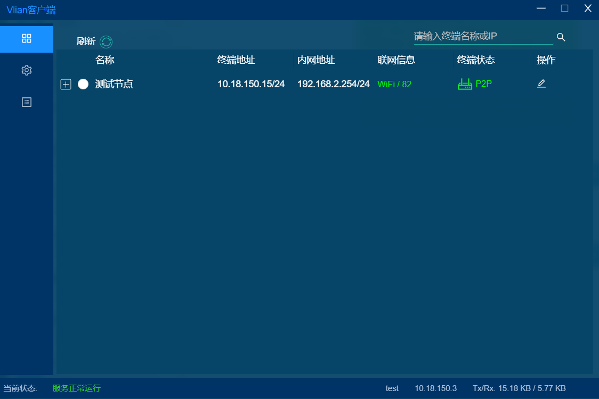
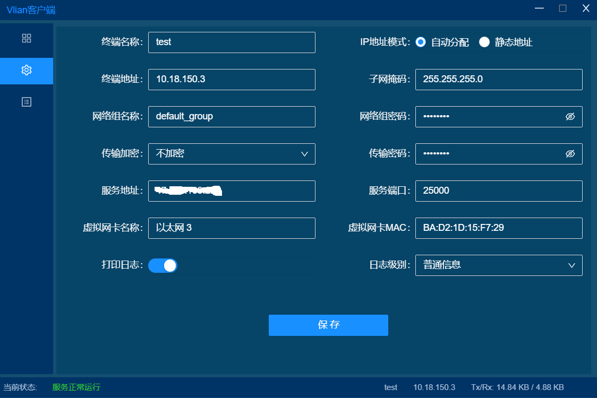
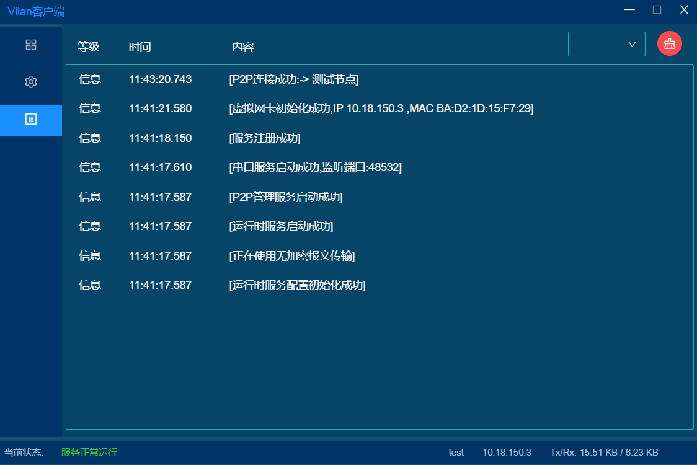

# 基于P2P的分布式局域网组建工具

## 介绍
- vilan系列软件为分布式节点电脑提供组建局域网的能力，并可实现节点之间P2P直连功能。
- vilan-peer是Windows节点接入的客户端程序,服务端程序为[vilan-server](https://gitee.com/net_vilan/vilan-server)

## 特性
- 提供组建分布式局域网的能力。
- 各个节点之间可实现P2P直连,较大降低网络延迟。
- 可通过路由设置访问节点所在内网主机。
- 集成串口远程通信功能，像本地串口一样跟远程串口通信。
- 简单友好的跨平台前端交互界面。

## 使用场景
- 跨区域组网。在没有足够公网IP的情况下，实现不同网络环境下各个节点之间的电脑互联。
- 远程协助。可实现无公网IP情况下的远程桌面。
- 远程调试。远程串口功能允许你调试远端接入的串口设备。

## 截图
- 首页

- 配置

- 日志

## 安装使用
1. 在使用客户端程序前，需在公网部署好Vilan-Server服务端程序。
2. 客户端组网互联功能底层依赖OpenVPN的虚拟网卡驱动,安装使用客户端前，请先安装[tap-windows-9.21.2.exe](3rd/tab-windows)。
3. 远程串口功能底层依赖com0com驱动，如需使用远程串口，请先安装[com0com](3rd/serialport)驱动。
4. 客户端程序需要使用管理员权限启动，启动前请先将程序添加到杀毒软件信任列表。
5. 打开客户端，配置合适的终端(节点)名称、IP地址分配模式(推荐自动获取)、网络组信息(一个网络组代表一个局域网)、服务端接入信息等，保存后左下角提示服务正常运行表示配置已正确。
6. 如需链接远程节点的内网电脑，请在交互界面点击选中该远程节点,该操作会在路由表中添加对应的路由项(切换节点或关闭客户端程序时自动删除该路由项)。
## 开发
调试构建开始前先安装[wails](https://github.com/wailsapp/wails) 2.0+
### 调试
在根目录下执行

    wails dev
golang IDE中可在go工具实参中添加以下参数，实现调试运行

    -gcflags "all=-N -l" -tags dev -o build/bin/vilan-peer.exe

### 构建
    wails build

## 致谢
- [n2n](https://github.com/ntop/n2n) a light VPN software which makes it easy to create virtual networks bypassing intermediate firewalls.。
- [water](https://github.com/songgao/water) A simple TUN/TAP library written in native Go.
- [wails](https://github.com/wailsapp/wails) Build desktop applications using Go & Web Technologies.
- [go-netty](https://github.com/go-netty/go-netty) Extensible network application framework inspired by netty.
- [com0com](https://github.com/tanvir-ahmed-m4/com0com) Null-modem emulator - The virtual serial port driver for Windows.
## 授权协议
本项目基于 Apache License Version 2.0 开源协议，请遵守以下规范。

- 不得将本项目应用于危害国家安全、荣誉和利益的行为，不能以任何形式用于非法行为。
- 使用源代码时请保留源文件中的版权声明和作者信息。
- 任何基于本项目二次开发而产生的一切法律纠纷和责任，均与作者无关。

更多信息请参考项目根目录下的LICENSE文件。